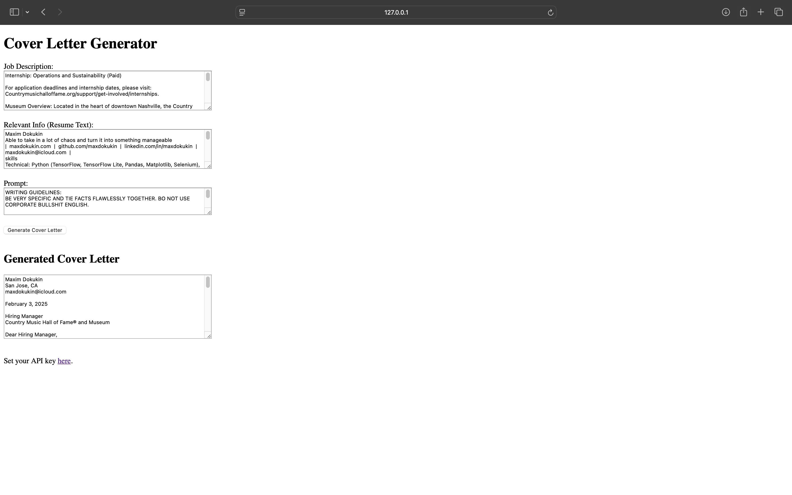

# Cover-Letter-AI-Generator

### A simple Flask-based web application that generates cover letters using OpenAI’s GPT API.

https://cover-letter-ai-generator-329494799718.us-central1.run.app

## You need your own OpenAI API Key! 
- Generate new API key (https://platform.openai.com/api-keys)
- Add money to the balance (as low as $5)

## Features
- Accepts **Job Description**, **Resume Info**, and **Custom Prompt** as input.
- Generates a professional cover letter using OpenAI’s GPT model.
- Stores inputs in memory for convenience.
- Allows setting an **API Key** via a separate page.
- **Automatically generates and downloads a PDF** of the cover letter after generation.

## Setup & Usage

### 1. Install Dependencies
```bash
pip install -r requirements.txt
```

### 2. Run the Application
```bash
python app.py
```

### 3. Open in Browser
Visit: [http://127.0.0.1:5000](http://127.0.0.1:5000)

### 4. Set API Key
Go to `/set_api_key`, enter your OpenAI API key, and save it.

### 5. Generate a Cover Letter
- Enter **Job Description**, **Resume Info**.
- Prompt is set by default, but can be modified by the user.
- Click **"Generate Cover Letter"** to get a customized cover letter.
- **The cover letter is automatically saved as a PDF and downloaded.**

### Screenshot:

